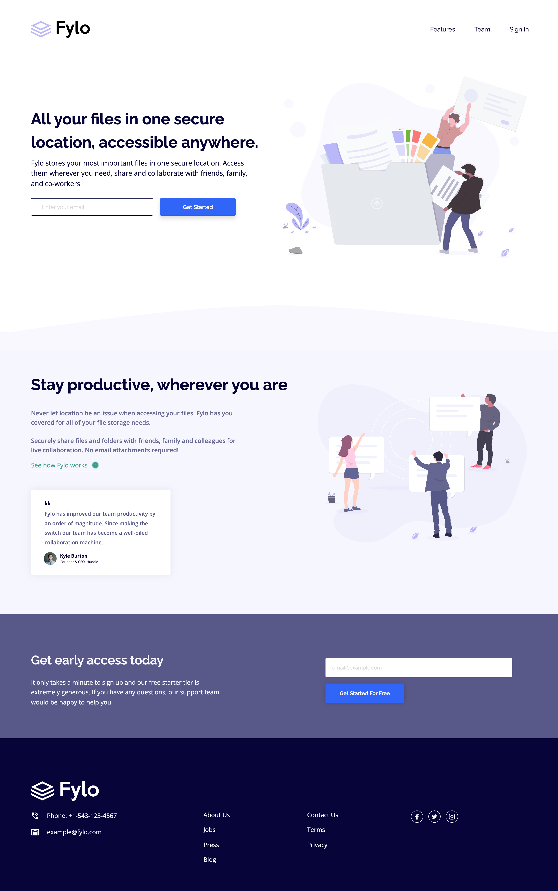

# Frontend Mentor - Fylo landing page with two column layout solution

This is a solution to the [Fylo landing page with two column layout challenge on Frontend Mentor](https://www.frontendmentor.io/challenges/fylo-landing-page-with-two-column-layout-5ca5ef041e82137ec91a50f5). Frontend Mentor challenges help you improve your coding skills by building realistic projects.

## Table of contents

- [Overview](#overview)
  - [The challenge](#the-challenge)
  - [Screenshot](#screenshot)
  - [Links](#links)
- [My process](#my-process)
  - [Built with](#built-with)
  - [What I learned](#what-i-learned)
  - [Continued development](#continued-development)
  - [Useful resources](#useful-resources)
- [Author](#author)

## Overview

### The challenge

Users should be able to:

- View the optimal layout for the site depending on their device's screen size
- See hover states for all interactive elements on the page

### Screenshot



### Links

- Solution URL: (https://www.frontendmentor.io/solutions/fylo-landing-page-with-two-column-layout-using-css-grid-and-variables-f7v2XGR2P)
- Live Site URL: (https://coder-txane.github.io/Fylo-Landing-Page-With-Two-Column-Layout-Challenge/)

## My process

### Built with

- Semantic HTML5 markup
- CSS custom properties
- Flexbox
- CSS Grid
- Mobile-first workflow

### What I learned

A major learning I discovered was of how to indirectly extend the underline of the 'See how Fylo works' link so that the line is also underneath the arrow icon adjacent to it. After copious amounts of investigating, I found an answer on Stack Overflow and while it isn't possible at this point in writing to directly extend an underline, one could use a border-bottom approach (as seen below). This creates a line of the whole box container, which meant I needed to create a wrapper container just wide enough of the content inside, which includes both the arrow icon and the link element. I was then able to adjust the indent of the border-bottom by adjusting the height of the container. This helped me acheive the extended underline appearance that I looked for to match the challenge design brief.

```css
.link-wrapper {
    display: inline-flex;
    border-bottom: var(--cyan) 2px solid;
    width: 193px;
    margin: 30px auto;
    height: 50px;
}
```

Furthermore, another discovery I made during the process of building this web page was the ability to indent text within a input box. I had initially tried to apply padding-left within the input box as a way of pushing the placeholder from the left, which had worked. However, this was a different case for when text was typed into the box as it was still too far to the left. I found on Stack Overflow that text-indent would not only indent the placeholder text but also any text typed into the input box as well.

```css
.email-input {
    width: 80%;
    margin: 15px auto 20px;
    height: 50px;
    text-indent: 25px;
}
```

Finally, 'MDN Web Docs' allowed me to learn how to effectively implement the :invalid pseudo class so that when a user types in their email address incorrectly the input box styling will change to highlight that there's been a mistake.

```css
.input-container input:invalid {
    border-color: #c92432;
    background: #fffafa;
}
```

### Continued development

Areas I intend on continuing to improve include:
- Form Validation Styling
- Responsive Sizing
- Accessibility

### Useful resources

- [Youtube](https://www.youtube.com/) - This website helped me visually learn best practices such as ways of building client-side form validation.
- [W3Schools](https://www.w3schools.com/) - This is an educational website that consists of useful tutorials in building web pages. I'd recommend it to anyone still learning web development or anyone who needs to refresh their memory on how to implement different concepts.
- [Stack Overflow](https://stackoverflow.com/) - A well-known community-based platform where fellow developers enquire and answer various coding questions. This site helped me find solutions to different issues I came across in the project by reading other developers' answers to a  similar question I had.
- [MDN Web Docs](https://developer.mozilla.org/) - This site provides information on every and anything about HTML, CSS and other web technologies. Highly recommened for in-depth knowledge on numerous topics.

## Author

- Frontend Mentor - [@coder-txane](https://www.frontendmentor.io/profile/coder-txane)